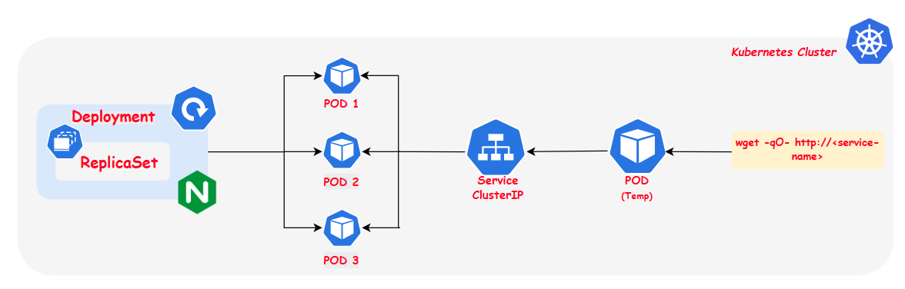

## 1 – Nginx Deployment with ClusterIP Service

### Project Overview

This project demonstrates the basic Kubernetes building blocks by deploying an **Nginx application** in a Kubernetes cluster using **Minikube**.

The goal is to understand how **Pods, Deployments, ReplicaSets, and Services** work together to run and expose applications inside a Kubernetes cluster.

In this project, we will deploy an **Nginx application with multiple replicas** and expose it internally using a **ClusterIP Service**.

---

### Concepts Covered

#### 1. Pods
A **Pod** is the smallest deployable unit in Kubernetes.  
It contains one or more containers that share networking and storage.

#### 2. Deployments
A **Deployment** manages the lifecycle of Pods. It ensures:
- The desired number of Pods are running
- Pods are recreated if they fail
- Updates can be rolled out safely

#### 3. ReplicaSets
A **ReplicaSet** ensures that a specified number of Pod replicas are always running.  
Deployments automatically create and manage ReplicaSets.

#### 4. Services (ClusterIP)
A **Service** provides a stable network endpoint for accessing Pods.

In this project we use:

**ClusterIP Service**
- Default Kubernetes service type
- Exposes the application **only inside the cluster**
- Allows communication between Pods

---

### Architecture

---

### Solution

Blog: [Deployment - Nginx App]()
Manifest Files: [Deployment]() and [Service]()

### Expected Outcome

After completing this project:

- Nginx should be running in **3 Pods**
- Pods should be managed by a **Deployment and ReplicaSet**
- A **ClusterIP Service** should expose the application internally
- The application should be accessible **from inside the Kubernetes cluster**

---

### Learning Outcome

By completing this project, you will understand:

- How **Deployments manage Pods**
- How **ReplicaSets maintain desired state**
- How **Services expose applications**
- How **Kubernetes handles scaling automatically**

This project forms the **foundation for understanding Kubernetes application deployment**.