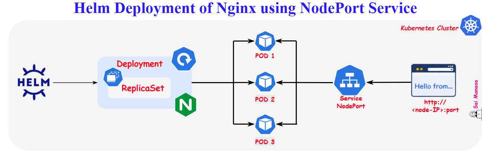

## 2 – Helm Deployment of Nginx with NodePort Service

### Project Overview

This project demonstrates how to deploy an **Nginx application in Kubernetes using Helm** and expose it externally using a **NodePort Service**.

In the previous project, we deployed an Nginx application and exposed it internally using a **ClusterIP Service** to understand the fundamental Kubernetes components.

In this project, we take the next step by packaging the Kubernetes resources into a **Helm chart** and exposing the application **outside the cluster** using a **NodePort Service**.

The goal is to understand how **Helm simplifies Kubernetes deployments** and how NodePort Services allow external access to applications running inside the cluster.

---

### Concepts Covered

#### 1. Helm Charts

A **Helm Chart** is a packaged collection of Kubernetes resources used to deploy applications in a Kubernetes cluster.

Helm charts help:

- Package Kubernetes manifests together
- Simplify application deployment
- Enable easier upgrades and rollbacks
- Manage application configuration using `values.yaml`

---

#### 2. Deployments

A **Deployment** manages the lifecycle of Pods and ensures the desired number of application instances are running.

It provides:

- Automatic Pod management
- Self-healing for failed Pods
- Easy scaling of applications

In this project, the Deployment runs **multiple Nginx Pods**.

---

#### 3. Services (NodePort)

A **Service** provides a stable network endpoint for accessing Pods.

In this project we use:

**NodePort Service**

- Exposes the application **outside the Kubernetes cluster**
- Opens a specific port on each node
- Routes incoming traffic to the Service, which then distributes it across Pods
- The application can be accessed using: **http://<node-ip>:<node-port>**

---

### Architecture

---

### Solution

- Blog: [Helm Deployment of Nginx using NodePort Service](https://saimanasak.medium.com/helm-deployment-of-an-nginx-application-using-a-nodeport-service-in-kubernetes-a7547c31ef5b)
- Helm Chart: [`nginx-nodeport-chart`](https://github.com/saimanasak/kubernetes/tree/main/battlefield/2-simple-nodeport-nginx-helm/helm-charts/nginx-nodeport-chart)

---

### Expected Outcome

After completing this project:

- Nginx should be deployed using a **Helm chart**
- The application should run in **multiple Pods**
- A **NodePort Service** should expose the application externally
- The application should be accessible using the - **http://<node-ip>:<node-port>**