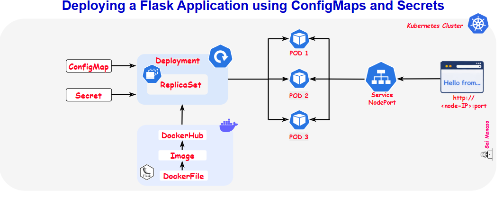

## 3 – Deploying a Flask Application using ConfigMaps and Secrets

### Project Overview

This project demonstrates how to deploy a **Flask application in Kubernetes** and manage its configuration using **ConfigMaps and Secrets**.

In real-world applications, configuration values and sensitive data such as database credentials should **not be hardcoded inside the application code**. Kubernetes provides dedicated resources like **ConfigMaps** and **Secrets** to manage this information separately from the application.

In this project, we deploy a simple **Flask API** using a **Deployment**, store application configuration in a **ConfigMap**, and securely manage database credentials using a **Secret**. The application is then exposed externally using a **NodePort Service** so it can be accessed from outside the cluster.

The goal is to understand how Kubernetes **separates application code from configuration** and how ConfigMaps and Secrets help manage application settings securely.

---

### Concepts Covered

#### 1. ConfigMaps

A **ConfigMap** is a Kubernetes resource used to store **non-sensitive configuration data** as key-value pairs.

ConfigMaps help:

- Keep configuration separate from application code
- Manage environment-specific settings
- Inject configuration into containers as **environment variables or files**
- Update application configuration without rebuilding container images

In this project, the ConfigMap stores:

- `APP_ENV`
- `APP_COLOR`

---

#### 2. Secrets

A **Secret** is a Kubernetes resource used to store **sensitive information** such as passwords, API keys, and tokens.

Secrets help:

- Protect sensitive configuration data
- Avoid storing credentials in application code or container images
- Inject secure data into containers as **environment variables or mounted files**

In this project, the Secret stores:

- `DB_USER`
- `DB_PASSWORD`

---

#### 3. Deployments

A **Deployment** manages the lifecycle of Pods and ensures that the desired number of application instances are running.

It provides:

- Automatic pod creation and management
- Self-healing if pods fail
- Easy scaling of application replicas

In this project, the Deployment runs **multiple Flask application pods**.

---

#### 4. Services (NodePort)

A **Service** provides a stable network endpoint for accessing Pods.

In this project we use:

**NodePort Service**

- Exposes the application **outside the Kubernetes cluster**
- Opens a specific port on each node
- Routes incoming traffic to the Service, which then distributes it across Pods
- The application can be accessed using: **http://<node-ip>:<node-port>**

---

### Architecture

---

### Solution

- Blog: *Deploying a Flask Application using ConfigMaps and Secrets in Kubernetes*
- [Manifests]()

---

### Expected Outcome

After completing this project:

- The Flask application should be deployed using a **Kubernetes Deployment**
- Configuration values should be stored in a **ConfigMap**
- Sensitive credentials should be stored in a **Secret**
- ConfigMap and Secret values should be injected into the container as **environment variables**
- The application should be exposed externally using a **NodePort Service**
- The Flask API should display the values received from the ConfigMap and Secret